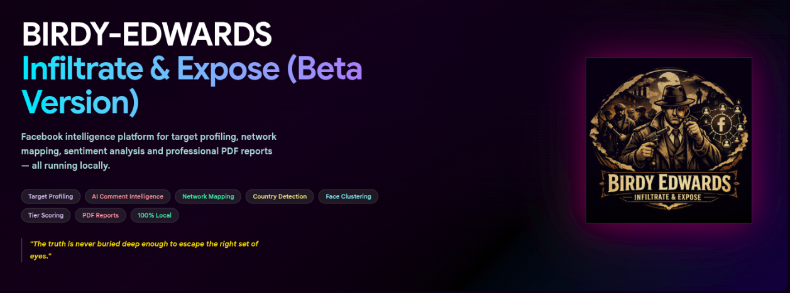

<div align="center">


# Crawling Bot

### *Facebook OSINT Platform*

[](https://python.org)
[](https://flask.palletsprojects.com)
[](https://github.com/D4Vinci/Scrapling)
[](https://docker.com)
[]()
[]()

**AI-powered Facebook OSINT platform — Scrapling stealth + NVIDIA NIM intelligence.**

[Installation](#installation) · [Troubleshooting](#troubleshooting) · [Disclaimer](#️-disclaimer)



</div>

---

## Architecture

Crawling Bot uses a **hybrid acquisition layer** — Scrapling provides the browser stealth context, fingerprint spoofing, and session persistence, while a thin Playwright bridge intercepts Facebook's native **GraphQL JSON responses** for structured data extraction. This gives you both undetectable browsing *and* access to Facebook's own internal data format (no fragile HTML parsing for primary content).

```
┌─────────────────────────────────────────────────────────┐
│                    Flask Web UI                          │
│          (dashboard, reports, investigation mgmt)         │
└─────────────────────┬───────────────────────────────────┘
                      │
┌─────────────────────▼───────────────────────────────────┐
│             5-Phase Pipeline Runner                      │
│                                                          │
│  Phase 1 ─► Data Gathering     (Scrapling + Playwright)  │
│  Phase 2 ─► DB Import          (SQLite)                  │
│  Phase 3 ─► AI Analysis        (NVIDIA NIM / Ollama)     │
│  Phase 4 ─► Intelligence       (scoring, country, graph) │
│  Phase 5 ─► Report             (PDF generation)          │
└─────────────────────────────────────────────────────────┘
```

### Browser Acquisition Layer

```
┌──────────────────────────────────────────────────────┐
│  scrapling_session.FBSession                          │
│                                                       │
│  ╔══════════════════════════════════════════════════╗ │
│  ║  Scrapling DynamicSession                       ║ │
│  ║  • persistent stealth Chromium context           ║ │
│  ║  • real user-agent generation / fingerprinting   ║ │
│  ║  • navigator.webdriver / automation masking      ║ │
│  ║  • Facebook cookie injection for auth             ║ │
│  ╚══════════════════════════════════════════════════╝ │
│                         │                              │
│                         ▼                              │
│  ┌─────────────────────────────────────────────────┐  │
│  │  Raw Playwright Page (context.new_page())        │  │
│  │  • page.on("response") → GraphQL JSON capture    │  │
│  │  • page.evaluate() → DOM clicks / expansion     │  │
│  │  • page.goto / page.screenshot / scrolling        │  │
│  └─────────────────────────────────────────────────┘  │
└──────────────────────────────────────────────────────┘
```

The key insight: Facebook loads content via **GraphQL API calls**, not HTML. Crawling Bot intercepts these network responses (structured JSON) via Playwright's `page.on("response")` and walks the JSON tree to extract posts, comments, photos, reels, and profile fields. DOM parsing is only used as a fallback. This makes extraction far more reliable than HTML selector-based scraping.

---

## Features

- 🔍 **Profile collection** — Automated data gathering of posts, photos, reels, about info, comments, and commentor profiles via GraphQL interception
- 🧠 **Interaction intelligence** — AI sentiment, stance, emotion, and language analysis per comment
- 📊 **Actor scoring** — Weighted composite score with 5-tier classification system
- 🌍 **Country detection** — LLM identifies country of origin from profile signals
- 👤 **Face intelligence** — Face detection, 128D encoding, and identity clustering across all images using HOG model
- 🕸️ **Network graphs** — Interactive HTML graphs (force-directed, co-interactor relationship matrix)
- 📄 **PDF reports** — Professional intelligence report with charts
- 🤖 **AI-powered analysis** — NVIDIA NIM (LLaMA 3.3 70B) for sentiment, stance, emotion, and country detection; Ollama also supported as an alternative
- 🐳 **Docker ready** — Single-command deployment on Linux and Windows

---

## ⚠️ Disclaimer

> Crawling Bot is developed strictly for **authorized intelligence, law enforcement, and academic research purposes only.**
>
> **Scope of data access:**
> - This tool operates exclusively using a valid Facebook session authenticated by the operator
> - It only accesses **publicly visible** profile data, posts, photos, reels, and comments
> - It does **not** access private messages, locked profiles, restricted content, or any data not visible to a logged-in user
> - It does **not** use bots, fake accounts, or automated account creation — the operator supplies their own authenticated session
>
> **Legal responsibility:**
> - This tool must only be used on profiles and content where you have **explicit legal authorization** to collect and analyze data
> - Use without authorization may violate Facebook's Terms of Service, applicable privacy laws (GDPR, IT Act, DPDP Act), and local regulations
> - The developer assumes **no liability** for misuse, unauthorized data collection, or any harm caused by improper use
> - All investigations are the **sole responsibility of the operator**
>
> By using Crawling Bot, you confirm that your use is lawful, authorized, and compliant with all applicable laws in your jurisdiction.

---

## System Requirements

| Component | Minimum | Recommended |
|---|---|---|
| OS | Ubuntu 24.04 LTS / Windows 10+ | Ubuntu 24.04 LTS |
| RAM | 8 GB | 16 GB |
| Storage | 20 GB free | 40 GB free |
| Docker | Docker Desktop / Engine | Latest stable |
| NVIDIA NIM API Key | Required | [Get one free](https://build.nvidia.com/) |
| Ollama (alternative) | Latest | Latest |

---

## Installation

### Prerequisites

**Step 1 — Install Docker**

- **Linux:** https://docs.docker.com/engine/install/ubuntu/
- **Windows:** https://docs.docker.com/desktop/install/windows-install/

**Step 2 — Get a NVIDIA NIM API Key (required)**

1. Go to [build.nvidia.com](https://build.nvidia.com/) and create an account
2. Generate an API key from your account dashboard
3. You'll set this in Step 3 of Quick Start below

**Step 3 (alternative) — Install Ollama**

If you prefer fully local inference (no cloud API), install Ollama instead:

```bash
curl -fsSL https://ollama.com/install.sh | sh
```

Start Ollama bound to all interfaces:

```bash
OLLAMA_HOST=0.0.0.0:11434 ollama serve
```

To make this permanent:
```bash
sudo systemctl edit ollama
```
Add:
```ini
[Service]
Environment="OLLAMA_HOST=0.0.0.0:11434"
```
```bash
sudo systemctl daemon-reload && sudo systemctl restart ollama
```

---

### Quick Start

**Step 1 — Clone the repository**

```bash
git clone <your-repo-url>
cd crawling-bot
```

**Step 2 — Create required files and directories**

- **Linux:**
```bash
mkdir -p app/reports app/face_data app/post_screenshots app/status
touch app/fb_cookies.json app/socmint.db app/socmint_manual.db
```

- **Windows (PowerShell):**
```powershell
New-Item -ItemType Directory app/reports, app/face_data, app/post_screenshots, app/status
New-Item -ItemType File app/fb_cookies.json, app/socmint.db, app/socmint_manual.db
```

**Step 3 — Set your NVIDIA NIM API key**

Edit `docker-compose.yml` and add your API key to the `environment` section:

```yaml
environment:
  - FLASK_ENV=production
  - FLASK_HOST=0.0.0.0
  - FLASK_PORT=5000
  - LLM_API_KEY=nvapi-xxxxxxxxxxxxxxxxxxxx
```

> If using Ollama instead, omit `LLM_API_KEY` and add `- LLM_BASE_URL=http://host.docker.internal:11434/v1`.

**Step 4 — Build the Docker image**

> ⚠️ First build takes **15–25 minutes** — dlib compiles from source. Subsequent builds are fast (layers cached).

```bash
docker compose build
```

**Step 5 — Start the container**

```bash
docker compose up -d

docker compose logs -f
```

**Step 6 — Open the web UI**

```
http://localhost:5000
```

**Step 7 — Import session cookies**

```
http://localhost:5000/tools/import-cookies
```

---

### Pull an AI Model (Ollama only)

If using **Ollama** instead of NVIDIA NIM, pull a model on your host machine:

```bash
ollama pull gemma3:4b
```

Or use the **AI Model panel** in the web UI — select a model and click **Apply & Pull**.

| RAM | Recommended Model |
|---|---|
| 8 GB | gemma3:4b |
| 16 GB | gemma3:12b |
| 32 GB | gemma3:27b |

> **NVIDIA NIM users:** No model pull needed — the model is hosted on NVIDIA's cloud. Just ensure your API key is set.

---

### Import Session Cookies

Crawling Bot requires a valid Facebook session. Use the **Cookie-Editor** browser extension.

> 🔒 **Operational Security:** It is strongly recommended to use a dedicated **burner account** for investigations rather than your personal Facebook account.

1. Install Cookie-Editor → [Chrome](https://chrome.google.com/webstore/detail/cookie-editor/hlkenndednhfkekhgcdicdfddnkalmdm) · [Firefox](https://addons.mozilla.org/en-US/firefox/addon/cookie-editor/)
2. Log into your **dedicated investigation account** on Facebook
3. Click Cookie-Editor while on facebook.com
4. Click **Export → Export as JSON**
5. Go to `http://localhost:5000/tools/import-cookies` and paste

---

## Hybrid Design: Scrapling + Playwright

Crawling Bot's scraping layer is a deliberate hybrid that uses each library where it excels:

| Concern | Handled by | Why |
|---|---|---|
| Browser launch & stealth | **Scrapling** `DynamicSession` | Real user-agent generation, fingerprint spoofing, Chromium automation masking, persistent context with cookie persistence |
| Cookie injection & session auth | **Scrapling** (via `_initialize_context`) | Cookies injected into the persistent stealth context before any page loads |
| GraphQL response capture | **Playwright** `page.on("response")` | Scrapling's `fetch()` opens short-lived pages; our scroll-driven loops need a persistent page with ongoing event listeners |
| DOM interaction (clicks, expansion, scroll) | **Playwright** `page.evaluate()` | Direct JavaScript injection for Facebook's comment panel expansion, "See more" clicks, and infinite scroll |
| HTML fallback scraping | **Scrapling** CSS/XPath selectors *(adaptable)* | For content that GraphQL doesn't cover; adaptive selectors survive DOM changes better than raw regex |
| Screenshots | **Playwright** `page.screenshot()` | Standard Playwright API, unchanged |
| Cookie harvesting (fresh login) | **Scrapling** `FBSession` | Clean stealth context for manual login, then harvest `context.cookies()` |

The boundary is enforced in code: `scrapling_session.FBSession` yields a plain Playwright `Page`, so every existing `page.goto()`, `page.on("response")`, `page.evaluate()` call works unchanged. The scrapers (`fb_*.py`) swapped only their `sync_playwright()...launch_browser` block for `with FBSession() as page:` — the extraction logic inside is untouched.

---

## Troubleshooting

**Ollama not reachable from Docker**
```bash
docker exec -it crawling-bot curl http://host.docker.internal:11434/api/tags
```
If it fails, restart Ollama with `OLLAMA_HOST=0.0.0.0:11434 ollama serve`

**NVIDIA NIM not reachable**  
Set `LLM_BASE_URL` and `LLM_API_KEY` environment variables in `docker-compose.yml`.

**DB error: no such table or other DB related error**  
Start a new investigation — schema is created automatically on first use. If you stop the process during analysis, delete that investigation and start a new one.

**Cookies expired**  
Go to `http://localhost:5000/tools/import-cookies` and re-import fresh cookies.

**Port 5000 already in use**  
Change in `docker-compose.yml`: `"5001:5000"` then access at `http://localhost:5001`

**Out of memory during build**  
Increase Docker Desktop memory to 8 GB+ via Settings → Resources → Memory

---

## Contributing

Contributions are welcome. Please follow these guidelines to keep the project clean and consistent.

**Reporting bugs**
- Open an Issue describing the bug, steps to reproduce, and your environment (OS, RAM, Docker version)
- Attach relevant logs from `docker compose logs`

**Feature requests**
- Open an Issue with a clear description of the feature and its use case
- Discuss before opening a Pull Request for large changes

**Submitting a Pull Request**
- Fork the repository
- Create a feature branch: `git checkout -b feature/your-feature-name`
- Commit your changes: `git commit -m "Add: short description"`
- Push to your branch: `git push origin feature/your-feature-name`
- Open a Pull Request against `main`

**Code guidelines**
- Follow existing code style — Python 3.12, Flask conventions
- Test your changes locally via Docker before submitting
- Do not commit `fb_cookies.json`, databases, or any scraped data

---

## Acknowledgements

- [Scrapling](https://github.com/D4Vinci/Scrapling) — Adaptive web scraping framework (stealth context, session management)
- [Playwright](https://playwright.dev/python/) — Browser automation and GraphQL interception
- [Ollama](https://ollama.com) — Local LLM inference engine
- [face_recognition](https://github.com/ageitgey/face_recognition) — Face detection and encoding library
- [pyvis](https://github.com/WestHealth/pyvis) — Interactive network graph visualization
- [reportlab](https://www.reportlab.com) — PDF generation
- [pytesseract](https://github.com/madmaze/pytesseract) — OCR engine wrapper

---

<div align="center">

**Crawling Bot** · Facebook OSINT Platform ·

</div>
